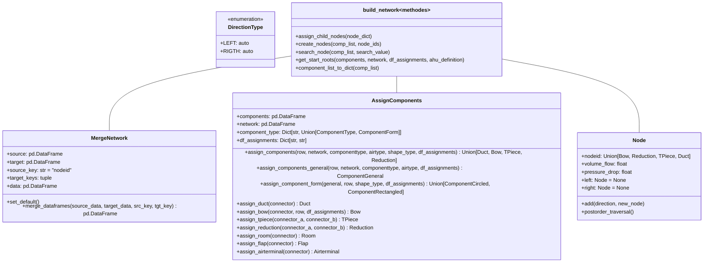
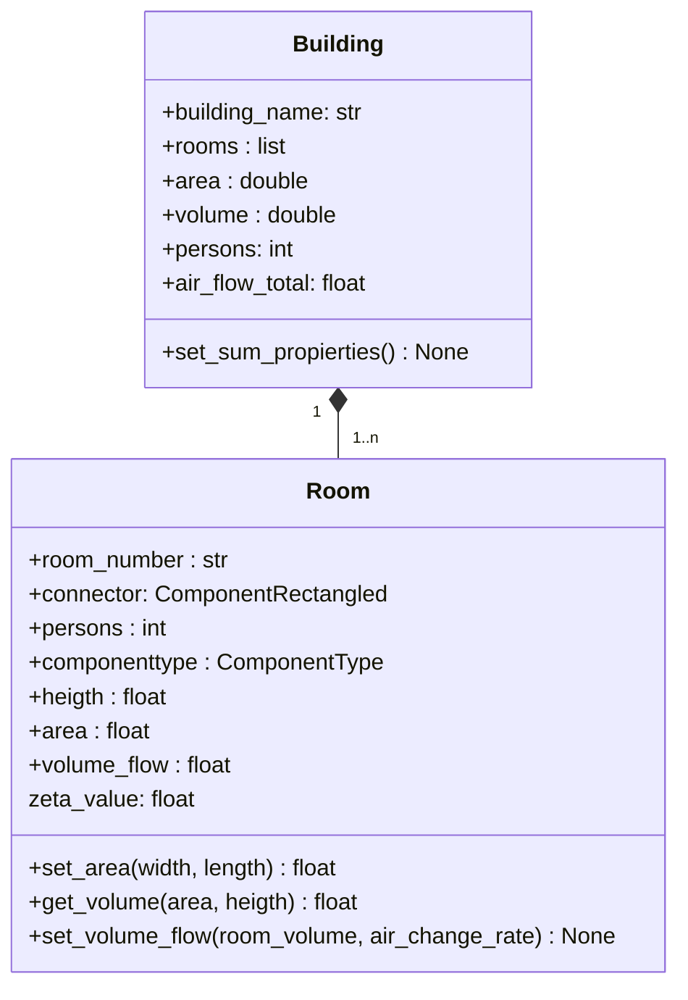
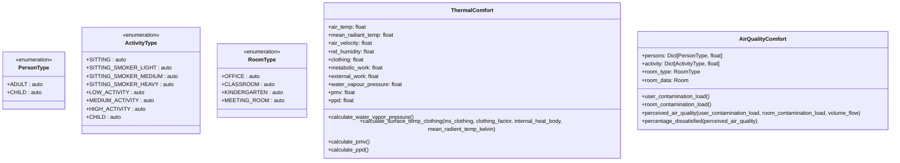

# Masterthesis Alexander Waringer
This work deals with the simulation of ventilation systems and their behavior under partial load.
The aim is to require as little information as possible for the transient analysis of ventilation systems.

## class diagramms
For a better overview, the class diagrams have been assigned using the corresponding module name.

### import_data
This module can be used to import weather, profile and ventilation network data. 
for the time being, data is imported via xlsx or csv. in future, tm2 and tm3 
data can also be integrated.

In addition, the data can be interpolated to a common value.

```mermaid
classDiagram
    class ImportType{
        <<enumeration>>
        +WEATHER : auto
        +LOAD_PROFILE : auto
        +USAGE_PROFILE : auto
        +NETWORK : auto
        +COMPONENTS: auto
    }

    class DocumentType{
        +XLSX : auto
        +CSV : auto
        +TM2 : auto
        +TM3 : auto
    }

    class ImportData{
        +dirpath : str
        +filename : str
        -fullpath : string
        +document_type : DocumentType
        +timezone: str
        +import_flag : ImportType
        +data : pd.DataFrame
        +load(fullpath, import_flag) pd.DataFrame
    }

    class InterpolateData{
        +source_data : pd.DataFrame
        +compared_data : pd.DataFrame
        +data : pd.DataFrame
        +interpolate(df_source_data, df_compared_data) pd.DataFrame
        +build_new_frameset(source, offset, start) pd.DataFrame
    }

    class WeatherImport{
        +source : pd.DataFrame
        +timezone : str
        +column_export : list
        +data : pd.DataFrame
        +set_default() None
        -__set_dtypes(df) pd.DataFrame
        -__clean_data_export(df, column_export) pd.DataFrame
    }

    class LoadProfileImport{
        +source : pd.DataFrame
        +timezone : str
        +first_row : int
        +column_export : list
        +column_keep: list
        +data : pd.DataFrame
        +set_default() None
        -__transform_data(df, first_row, column_keep, column_export) pd.DataFrame
        -__set_dtypes(df) pd.DataFrame
    }

    class UsageProfileImport{
        +source : pd.DataFrame
        +data : pd.DataFrame
        -__convert_percentage(column_name) pd.DataFrame
    }

    class NetworkImport{
        +source : pd.DataFrame
        +column_list : list
        +column_dict : dict
        +column_export : list
        +data : pd.DataFrame
        +set_default() None
        -__filter_dataaframes(df, column_list, column_dict)
        -__clean_data_export(df, column_export) pd.DataFrame
    }

    class ComponentImport{
        +source : pd.DataFrame
        +column_list : list
        +column_dict : dict
        +column_check : dict
        +column_export : list
        +rectangled_info : dict
        +reduction_info : dict
        +pd_dtypes : dict
        +data : pd.DataFrame
        +set_default() None
        -__filter_dataframes(df, column_list, column_dict) pd.DataFrame
        -__build_network(df, columns_check, rectangled_info, reduction_info) pd.DataFrame
        -__set_dtypes(df) pd.DataFrame
        -__clean_data_export(df, column_export) pd.DataFrame
    }
    
    ImportData "1" *-- "2" InterpolateData
    ImportData -- WeatherImport
    ImportData -- ComponentImport
    ImportData -- LoadProfileImport
    ImportData -- NetworkImport
    ImportData -- UsageProfileImport
```

### air_ahandling_units
the ventilation units including all heaters are instantiated in this module

```mermaid
classDiagram
    class RegisterType{
        <<enumeration>>
        +COOLING : auto
        +HEATING : auto
    }

    class HeatRecoveryType{
        <<enumeration>>
        +ROTARY : auto
        +PLATE : auto
        +COMPUNDSYSTEM : auto
    }

    class Conversion{
        <<enumeration>>
        +M3_H_M3_S : auto
        +M3_S_M3_H : auto
    }
    class UnitType{
        <<enumeration>>
        +FAN : auto
        +REGISTER : auto
        +HEATRECOVERY : auto
    }
    
    class Fan{
        +volume_flow_nominal : float
        +electrical_power_nominal: float
        +sfp_class: int
        +efficiency : float
        +unit_type : UnitType = UnitType.FAN
        +get_sfp_class_efficiency(volume_flow, electrical_power) int
        +calculate_current_power(volume_flow) float
    }

    class Register{
        +register_type : RegisterType
        +max_power : float
        +unit_type : UnitType = UnitType.REGISTER
        +calculate_current_power(volume_flow, sa_temperature_in, sa_temperature_out) float
        +caclulate_out_temperature(volume_flow, sa_temperature_in, power) float
    }

    class HeatRecovery{
        +recovery_type : HeatRecoveryType
        +temp_oa_nominal : float
        +temp_sa_nominal : float
        +temp_ra_nominal : float
        +heat_exchanger_coefficient : float
        +unit_type : UnitType = UnitType.HEATRECOVERY
        +get_heat_exchanger_coefficient() float
        +calculate_current_power(volume_flow, oa_temperature, sa_temperature) float
        +calculate_out_temperature(ra_Temperature, oa_temperature) float
    }


```

### air_components
all pipe duct components are instantiated in this module

```mermaid
classDiagram
    class ComponentForm{
        <<enumeration>>
        +CIRCLED : auto
        +RECTANGLED : auto
    }

    class ComponentType{
        <<enumeration>>
        +DUCT : auto
        +BOW : auto
        +REDUCTION: auto
        +TPIECE : auto
        +AIRTERMINAL: auto
        +ROOM: auto
        +FLAP: auto
        +FAN: auto
    }

    class ComponentOrientation{
        <<enumeration>>
        +VERTICAL : auto
        +HORIZONTAL : auto
    }

    class ReductionType{
        <<enumeration>>
        +EXTENSION : auto
        +NARROWING : auto
    }

    class ComponentAirType{
        <<enumeration>>
        +EA : "FOL"
        +OA : "AUL"
        +SA : "ZUL"
        +RA : "ABL"
    }

    class ComponentGeneral{
        +component_id : str
        +orientation : ComponentOrientation
        +componenttype : ComponentType
        +airtype : ComponentAirType
        +port_a : string
        +port_b : string
    }


    class ComponentCircled{
        +general : ComponentGeneral
        +length : float
        +diameter : int
        +area : float
        +shape : ComponentForm = ComponentForm.CIRCLED
        -_calculate_area() None
    }

    class ComponentRectangled{
        +general : ComponentGeneral
        +length : float
        +width: int
        +heigth : int
        +area : float
        +shape : ComponentForm = ComponentForm.RECTANGLED
        -_calculate_area() None
    }

    class Duct{
        +connector : Union[ComponentCircled, ComponentRectangled]
        +mean_velocity : float
        +componenttype : ComponentType = ComponentType.DUCT
        +lambda_value : float 
        -_get_diameter(self) float
        -_get_reynolds(mean_velocity, diameter) float
        +set_lambda(reynolds_number) None
        }

    class Reduction{
        +connector_a : Union[ComponentCircled, ComponentRectangled]
        +connector_b : Union[ComponentCircled, ComponentRectangled]
        +componenttype : ComponentType = ComponentType.REDUCTION
        +zeta_value : float 
        -_angle_rad : float
        +get_zeta_value() None
    }

    class TPiece{
        +connector_a : Union[ComponentCircled, ComponentRectangled]
        +connector_b : Union[ComponentCircled, ComponentRectangled]
        +componenttype : ComponentType = ComponentType.TPIECE
        +zeta_value : float
        -_get_factor_v1_v() float
        +get_zeta_value() None
    }

    class Bow{
        +connector : Union[ComponentCircled, ComponentRectangled]
        +angle : int
        +componenttype : ComponentType = ComponentType.BOW
        +zeta_value : float
        -_angle_rad : float
        -_set_length() None
        -_get_factor_r_d() float
        -_set_zeta_value(angle) None
    }

    class Flap{
        +connector : Union[ComponentCircled, ComponentRectangled]
        +componenttype : ComponentType = ComponentType.FLAP
        +alpha_angle: float
        +get_adjust_angle(volume_flow) float
        +get_pressure_drop(alpha_angle) float
    }

    class Airterminal{
        +connector : Union[ComponentCircled, ComponentRectangled]
        +componenttype : ComponentType = ComponentType.AIRTERMINAL
        +zeta_value : float
    }

    class ComponentList{
        +obj : List[Union[Duct, Bow, Reduction, TPiece]]
    }

    ComponentGeneral "1" --> "1..n" ComponentCircled
    ComponentGeneral "1" --> "1..n" ComponentRectangled
    ComponentCircled "1" --* "0..n" Duct
    ComponentRectangled "1" --* "0..n" Duct
    ComponentCircled "1" --* "0..n" Reduction
    ComponentRectangled "1" --* "0..n" Reduction
    ComponentCircled "1" --* "0..n" TPiece
    ComponentRectangled "1" --* "0..n" TPiece
    ComponentCircled "1" --* "0..n" Bow
    ComponentRectangled "1" --* "0..n" Bow
    ComponentCircled "1" --* "0..n" Flap
    ComponentRectangled "1" --* "0..n" Flap
    ComponentCircled "1" --* "0..n" Airterminal
    ComponentRectangled "1" --* "0..n" Airterminal
```

### build_network
The build_network module contains classes and functions for building a ventilation network based on the imported data.

### building_information
In this module, the classes for the building and the rooms are defined.
The building class holds the rooms and sums up the properties of the rooms in the building.
The room class holds the properties of a room and calculates the volume flow of the room.

### evaluation_criteria
This module is used to evaluate the predicted mean value of votes (PMV) and the 
predicted percentage of dissatisfaction (PPD). This is done using input parameters 
from other modules. The module is also used to evaluate the perceived air quality.

### thermodynamics
This module contains the classes and functions for the thermodynamics calculations.

```mermaid
classDiagram
    class TemperatureType{
        <<enumeration>>
        +CELSIUS : auto
        +KELVIN : auto
        +FAHRENHEIT : auto
    }

    class HumidityType{
        <<enumeration>>
        +RELATIV : auto
        +ABSOLUT : auto
    }

    class MetabolicRate{
        <<enumeration>>
        BASE: auto
        RELAXED_SITTING: auto
        LIGHT_SEDENTARY: auto
        LIGHT_STANDING: auto
        STANDING_MODERATE_ACTIVITY: auto
    }

    class Converting{
        <<enumeration>>
        M3_H_M3_S: auto
        M3_S_M3_H: auto
    }

    class RoomLoad{
        +persons : int
        +windows: Dict[str, float]
        +walls: Dict[str, float]
        +transmission_types: Dict[str, float]
        -radiation_windows: Dict[str, float]
        -mean_transmission: dict
        -cooling_load_factor_radiation: pd.DataFrame
        -cooling_load_factor_machine: pd.DataFrame
        -heat_emissions: pd.DataFrame
        +load_total(internal_load, external_load, support_system) float
        +load_internal(load_persons, load_machines, load_light, load_diff_temperature) float
        +load_persons(heat_emissions, load_factor) float
        +heat_emission_dataframe() pd.DataFrame
        +load_light(power, simultaneity, room_load_factor, load_factor) float
        +load_machines(simultaneity, load_factor, sum_machine_power) float
        +sum_machine_power(power_efficency, load_factors) float
        +radiation_dataframe() pd.DataFrame
        +mean_transmission_coefficient() dict
        +progression_cooling_load() pd.DataFrame
        +load_diff_temperature(heat_transmission, delta_temp) float
        +load_external(load_external_walls, load_transmission_windows, load_radiation_windows) float
        +load_external_walls(heat_transmission, delta_temp_equivalent) float
        +load_transmission_windows(heat_transmission, external_temperature, room_temperature) float
        +cooling_load_radiation() pd.DataFrame
        +get_heat_emission(temperature, activity) float
        +get_cooling_load_factor_machhine(date_time, room_type_equipment) float
        +get_cooling_load_factor_radiation(date_time, factor_type) float
        +get_radiation_window(date_time, orientation) float
        +load_radiation_windows(cooling_load_factor, radiation_window) float

    }

    class CarbonDioxide{
        +outdoor_co2 : float
        +room_co2 : float
        +room_volume: float
        +persons_adult: int
        +persons_chuild: int
        +calculate_co2_persons(persons_adult, persons_child) float
        +conversion_flow(flow, direction) float
        +calculate_room_volume(area, height) None
        +calculate_co2_concentration(flow_in, co2_generated) float
    }

    class Pressure{
        +component: Union[Bow, Reduction, TPiece, Duct, Room, Flap]
        +volume_flow: float
        +connector: str
        +mean_velocity: float
        +pressure_drop: float
        -_set_connector() None
        +set_mean_velocity(volume_flow) None
        +set_pressure_drop() None
    }

    class ExportDataToAirComponents{
        +timestamp: pendulum.datetime
        +temperature: float
        +volume_flow: float
        +pressure_drop: float
        -mass_flux: float
        -density: float
        -set_density(temperature) None
        -set_mass_flux(volume_flow, density) None
    }

```

